# TP1 — Premiers pas (CSC 8607 – Introduction au deep learning)

**Identifiant TSP :** sbouchet

---

## Exercice 1 — Utilisation de SLURM

### 1.a Premiers pas en mode interactif avec srun

Pour avoir un GPU en mode interactif j'ai utilisé la commande :

```bash
srun --partition=gpu --gres=gpu:1 --time=01:00:00 --cpus-per-task=1 --mem=8G --pty bash
```

Une fois connecté au nœud de calcul, j'ai lancé `nvidia-smi` :

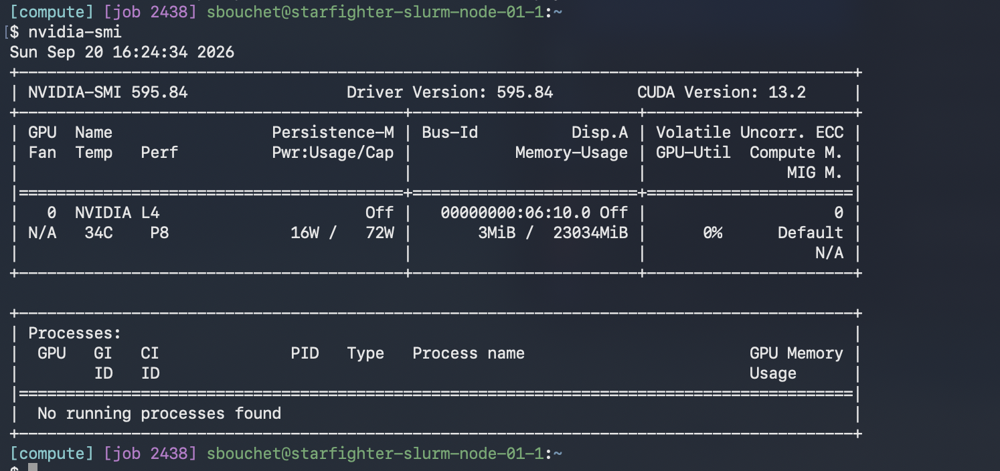

**Modèle exact du GPU alloué :** `NVIDIA L4` (23034 MiB de mémoire, driver 595.84, CUDA 13.2).

### 1.b Observer et arrêter ses jobs : squeue, scancel

Dans un nouveau terminal j'ai regardé mes jobs avec `squeue -u $USER`, le JobID de mon job interactif est **2438** :

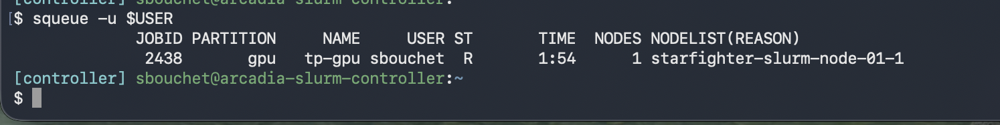

**Commande exacte utilisée pour annuler le job :**

```bash
scancel 2438
```

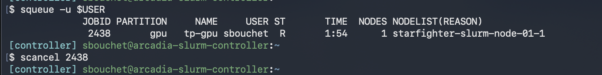

### 1.c Soumettre un script non interactif avec sbatch

Script `hello.sh` complété :

```bash
#!/bin/bash
#SBATCH --partition=gpu
#SBATCH -t 01:00:00
#SBATCH --gres=gpu:1
#SBATCH --cpus-per-task=1
#SBATCH --mem=8G
#SBATCH -J hello-slurm
#SBATCH -o logs/%x-%j.out
#SBATCH -e logs/%x-%j.err

set -euo pipefail
mkdir -p logs

echo "Job $SLURM_JOB_ID on $SLURM_NODELIST"
nvidia-smi || echo "nvidia-smi indisponible"
echo "Bonjour depuis SLURM !"
```

Je l'ai soumis avec `sbatch hello.sh`, le job a eu le JobID **2439**.

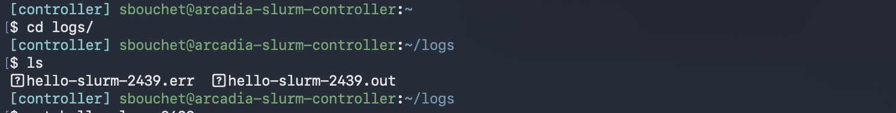

**Nom exact du fichier de log :** `hello-slurm-2439.out` (et `hello-slurm-2439.err` pour les erreurs).

Contenu du fichier :

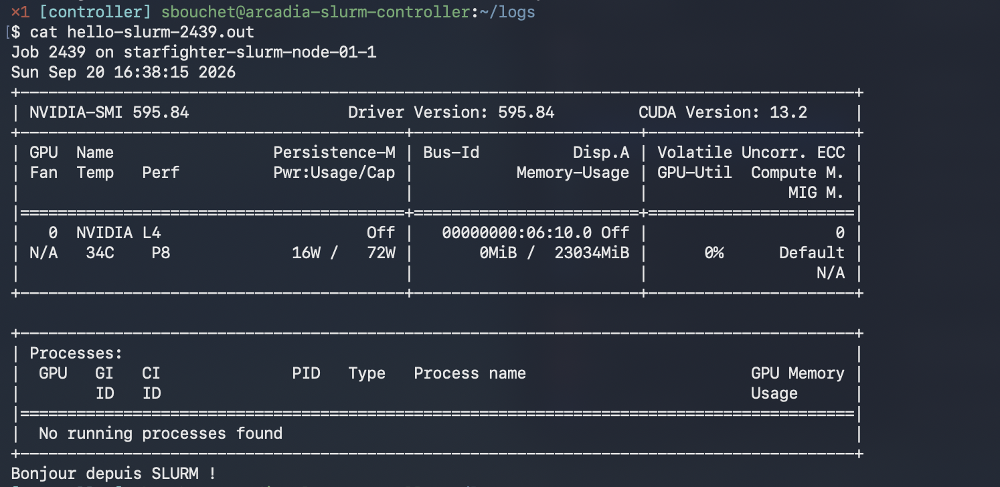

### 1.d Analyser ses jobs : sacct

```bash
sacct -j 2439 --format=JobID,State,Elapsed,MaxRSS,ReqMem,ReqCPUS
```

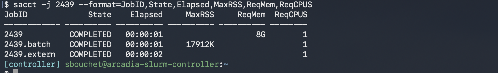

**Différence entre ReqMem et MaxRSS :**

La ReqMem est la mémoire qui a été demandée pour exécuter le job (ici 8G).

La MaxRSS est la valeur réelle maximum de RAM qui a été utilisée durant l'exécution du job, en l'occurrence ici 17912 Ko (environ 17 Mo) sur `2439.batch`. On voit donc qu'on a demandé beaucoup plus que ce que le script a vraiment utilisé.

---

## Exercice 2 — Création d'un environnement virtuel Python

### 2.a Installation de Miniforge/Mamba et création de l'environnement

```bash
curl -L -O "https://github.com/conda-forge/miniforge/releases/latest/download/Miniforge3-$(uname)-$(uname -m).sh"
bash Miniforge3-$(uname)-$(uname -m).sh
mamba create -n deeplearning python=3.10
mamba activate deeplearning
```

### 2.b Version de Python et chemin du binaire

**Commandes utilisées :**

```bash
which python
python --version
```

**Résultat :**

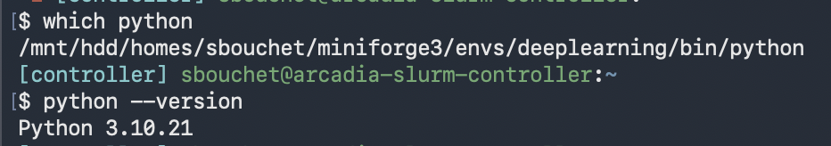

```
/mnt/hdd/homes/sbouchet/miniforge3/envs/deeplearning/bin/python
Python 3.10.21
```

### 2.c Installation de PyTorch (GPU) + TensorBoard

```bash
mamba install pytorch torchvision torchaudio pytorch-cuda=12.1 -c pytorch -c nvidia
mamba install tensorboard -c conda-forge
```

### 2.d Vérification de l'installation PyTorch + CUDA

Script `check_gpu.py` complété :

```python
import torch

print("PyTorch version:", torch.__version__)
gpu_available = torch.cuda.is_available()
print("CUDA available:", gpu_available)

if gpu_available:
    print("Device count:", torch.cuda.device_count())
    print("Device 0 name:", torch.cuda.get_device_name(0))
else:
    print("Attention, aucun GPU détecté !")
```

**Sortie du script :**

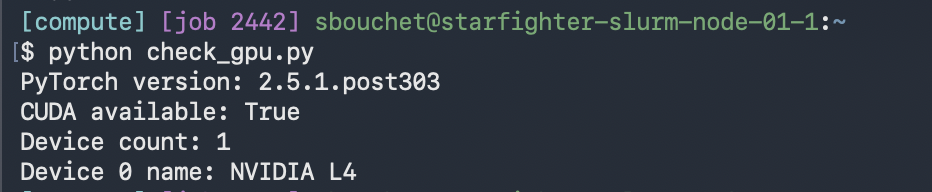

```
PyTorch version: 2.5.1.post303
CUDA available: True
Device count: 1
Device 0 name: NVIDIA L4
```

CUDA available retourne bien `True` donc PyTorch détecte le GPU.

### 2.e Rendre l'environnement reproductible

```bash
mamba env export --from-history -n deeplearning > environment.yml
```

Le fichier `environment.yml` est ajouté dans le dossier TP1 du dépôt.

### 2.f Bonus — Vérifier TensorBoard

La commande qui permet d'afficher la version de TensorBoard est :

```bash
tensorboard --version
```

---

## Exercice 3 — Exercices théoriques

### 3.a Architecture et paramètres

Schéma du MLP avec 3 neurones en entrée, 4 neurones dans la couche cachée et 2 neurones en sortie :

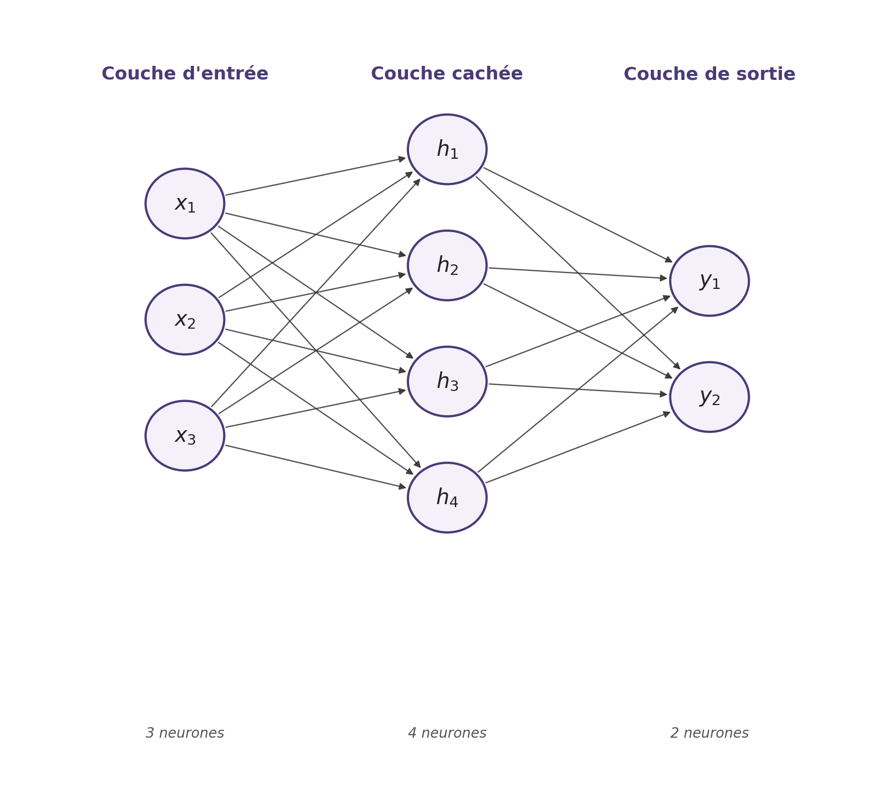

**Nombre de paramètres sans les biais :**

Chaque neurone d'une couche est relié à tous les neurones de la couche suivante, donc on multiplie le nombre de neurones des deux couches :

- Couche 1 (entrée → cachée) = 3 × 4 = 12
- Couche 2 (cachée → sortie) = 4 × 2 = 8
- **Total sans biais = 12 + 8 = 20**

**Nombre de paramètres avec les biais :**

Il y a un biais par neurone de la couche d'arrivée :

- Couche 1 = 12 + 4 = 16
- Couche 2 = 8 + 2 = 10
- **Total avec biais = 16 + 10 = 26**

### 3.b Équations et dimensions

```
H = ReLU( X · W1^T + b1 )
Y = H · W2^T + b2

Dimensions :
X  : (N, 3)
W1 : (4, 3)
b1 : (1, 4) -> diffusé en (N, 4)
H  : (N, 4)
W2 : (2, 4)
b2 : (1, 2) -> diffusé en (N, 2)
Y  : (N, 2)
```

### 3.c Graphe de calcul et rétropropagation

On considère $f(x, y, z) = \frac{x}{y} + z$ avec le nœud intermédiaire $q = \frac{x}{y}$.

**1. Graphe de calcul :**

```
x ──┐
    ├─▶ [ ÷ ] ──▶ q ──┐
y ──┘                 ├─▶ [ + ] ──▶ f
z ────────────────────┘
```

**2. Forward pass** avec x = 2, y = 4, z = 0 :

$$q = \frac{x}{y} = \frac{2}{4} = 0.5$$

$$f = q + z = 0.5 + 0 = 0.5$$

**3. Backpropagation :**

On calcule d'abord les dérivées locales :

- $\frac{\partial f}{\partial q} = 1$ et $\frac{\partial f}{\partial z} = 1$
- $\frac{\partial q}{\partial x} = \frac{1}{y} = \frac{1}{4} = 0.25$
- $\frac{\partial q}{\partial y} = -\frac{x}{y^2} = -\frac{2}{16} = -0.125$

Puis avec la chain rule :

$$\frac{\partial f}{\partial x} = \frac{\partial f}{\partial q} \cdot \frac{\partial q}{\partial x} = 1 \times 0.25 = 0.25$$

$$\frac{\partial f}{\partial y} = \frac{\partial f}{\partial q} \cdot \frac{\partial q}{\partial y} = 1 \times (-0.125) = -0.125$$

$$\frac{\partial f}{\partial z} = 1$$

### 3.d Mise à jour des poids (η = 1)

On applique la descente de gradient : $x' = x - \eta \cdot \frac{\partial f}{\partial x}$ (pareil pour y et z).

$$x' = 2 - 1 \times 0.25 = 1.75$$

$$y' = 4 - 1 \times (-0.125) = 4.125$$

$$z' = 0 - 1 \times 1 = -1$$

Nouvelle sortie :

$$f' = \frac{1.75}{4.125} + (-1) \approx 0.424 - 1 \approx -0.576$$

La valeur de la fonction est passée de 0.5 à environ −0.576, elle a donc bien diminué comme attendu.

### 3.e Questions de réflexion

**Pourquoi utilise-t-on la règle de la chaîne ?**

Un réseau de neurones profond est une composition de plein de fonctions (une par couche). La chain rule va permettre de calculer le gradient de la loss par rapport à n'importe quel paramètre en multipliant les dérivées locales le long du chemin entre la sortie et ce paramètre. C'est le principe de la rétropropagation.

**Pourquoi utiliser des mini-batchs ?**

Avec un seul exemple à la fois le gradient est très bruité et on n'exploite pas le parallélisme du GPU. Avec toutes les données d'un coup le gradient est exact mais c'est très coûteux à calculer et on fait peu de mises à jour. Les mini-batchs sont un compromis : on a une estimation correcte du gradient, on utilise bien le GPU, et le petit bruit restant peut aider à sortir des minima locaux.

### 3.f Association

| Tâche | Fonction finale (Sortie) | Fonction de perte (Loss) |
|---|---|---|
| Classification binaire | 1. Sigmoïde | A. Binary Cross-Entropy (BCE) |
| Classification multi | 2. Softmax | B. Cross-Entropy |
| Régression pure | 3. Identité (aucune) | C. MSE (Mean Squared Error) |

---

## Exercice 4 — Votre premier réseau de neurones

### Étape 1 : Préparation des données

Code complété dans `train.py` :

```python
trainset = datasets.CIFAR10(root='./data', train=True, download=True, transform=transform)
testset  = datasets.CIFAR10(root='./data', train=False, download=True, transform=transform)

trainloader = torch.utils.data.DataLoader(
    trainset, batch_size=32, shuffle=True, num_workers=num_workers, pin_memory=True
)
testloader = torch.utils.data.DataLoader(
    testset, batch_size=32, shuffle=False, num_workers=num_workers, pin_memory=True
)
```

Le batch size va permettre de savoir combien d'images on va envoyer à la fois, le shuffle va permettre de mélanger les images que le modèle va recevoir à chaque époque. Ça va permettre à ce qu'il ne soit pas influencé par l'ordre des données durant l'apprentissage.

Durant la phase de test shuffle doit être False car on n'a pas besoin de les mélanger, on veut juste tester l'efficacité de l'entraînement sur des images.

### Étape 2 : Implémentation du réseau

```python
class MLP(nn.Module):
    def __init__(self):
        super().__init__()
        self.fc1 = nn.Linear(3 * 32 * 32, 128)  # couche cachée
        self.fc2 = nn.Linear(128, 10)           # couche de sortie (logits)

    def forward(self, x):
        x = torch.flatten(x, 1)
        x = F.relu(self.fc1(x))
        x = self.fc2(x)
        return x
```

**Question 1 — Pourquoi `torch.flatten(x, 1)` ?**

`torch.flatten(x, 1)` transforme chaque image 3D de taille 3 × 32 × 32 en un vecteur de 3072 valeurs afin de pouvoir l'envoyer dans une couche linéaire. Le paramètre 1 indique que l'aplatissement commence à partir de la dimension 1 : la dimension 0, correspondant à la taille du batch, est donc conservée. Ainsi, un tenseur de taille [N, 3, 32, 32] devient [N, 3072].

**Question 2 — Pourquoi ne pas mettre Softmax ?**

On ne met pas de Softmax à la sortie du réseau car `nn.CrossEntropyLoss` est conçue pour recevoir directement les logits bruts produits par la dernière couche linéaire. Elle effectue elle-même les opérations nécessaires pour calculer la perte de classification. Ajouter un Softmax avant `CrossEntropyLoss` serait donc inutile et peut rendre le calcul moins stable numériquement.

### Étape 3 : Entraînement du modèle

```python
optimizer.zero_grad(set_to_none=True)
outputs = model(inputs)
loss = criterion(outputs, labels)
loss.backward()
optimizer.step()
```

`optimizer.zero_grad()` sert à réinitialiser les gradients des paramètres du modèle avant de traiter un nouveau mini-batch, car PyTorch accumule les gradients par défaut. En revanche, `loss.backward()` effectue la rétropropagation à partir de la fonction de perte et calcule les nouveaux gradients de chaque paramètre du réseau. La mise à jour effective des poids est ensuite réalisée par `optimizer.step()`.

### Étape 4 : Évaluation sur l'ensemble de test

1. `with torch.no_grad():` est utilisé pendant l'évaluation pour désactiver le calcul des gradients. Comme on ne fait ni rétropropagation ni mise à jour des poids pendant le test, les gradients sont inutiles. Cela permet de réduire l'utilisation de la mémoire, notamment la mémoire GPU, et de rendre l'évaluation plus rapide.

2. CIFAR-10 contient 10 classes. Si le classificateur prédisait une classe complètement au hasard, il aurait environ 1 chance sur 10 de tomber sur la bonne classe. Son accuracy serait donc d'environ 10 %.

### Étape 5 : Sauvegarde du modèle

```python
torch.save(model.state_dict(), "mlp_model.pth")
```

---

## Exercice 5 — Utilisation de TensorBoard

### Étape 1 — Nom des dossiers de logs

Code complété dans `train_tb.py` :

```python
run_name = f"{hparams['model']}/bs{hparams['batch_size']}_lr{hparams['lr']}_{datetime.datetime.now().strftime('%Y%m%d-%H%M%S')}"
logdir = os.path.join("runs", run_name)
writer = SummaryWriter(log_dir=logdir)

N = len(trainset)
val_size = int(0.1 * N)
train_size = N - val_size
train_subset, val_subset = random_split(trainset, [train_size, val_size], generator=torch.Generator().manual_seed(0))

trainloader = DataLoader(train_subset, batch_size=hparams["batch_size"], shuffle=True, pin_memory=True)
valloader   = DataLoader(val_subset,   batch_size=hparams["batch_size"], shuffle=False, pin_memory=True)
```

Il est utile d'inclure la date, l'heure et les hyperparamètres dans le nom du dossier de logs afin de distinguer facilement les différentes expériences. Cela permet de retrouver précisément quelle configuration a produit chaque résultat et de comparer plusieurs entraînements dans TensorBoard sans écraser les expériences précédentes.

### Étape 3 — Instrumentation de l'entraînement

```python
if b % 10 == 0:
    writer.add_scalar("Loss/train_step", loss.item(), global_step)
...
writer.add_scalar("Loss/train", train_loss, epoch)
writer.add_scalar("Loss/val",   val_loss, epoch)
writer.add_scalar("Accuracy/val", val_acc, epoch)
...
writer.close()
```

### Étape 4 — Smoothing et bruit des courbes

J'ai récupéré le dossier `runs/` en local puis lancé TensorBoard :

```bash
scp -r tsp-client:~/TP1/runs ./runs
tensorboard --logdir=runs
```

Avec un smoothing bas (0.2), la courbe `Loss/train_step` reste très bruitée :

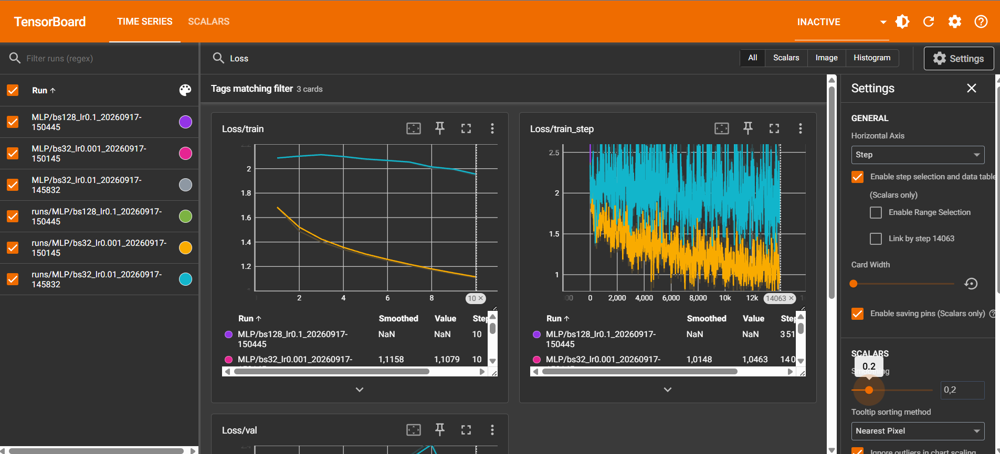

Avec un smoothing plus élevé (0.7), la tendance devient bien lisible :

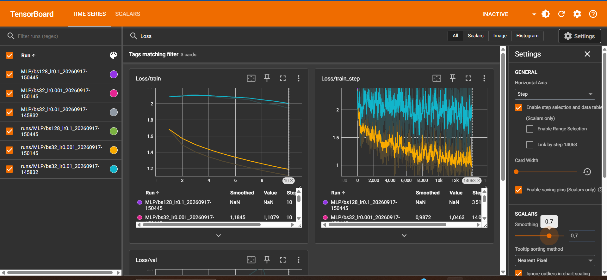

Un smoothing autour de **0.6 – 0.7** permet de distinguer clairement la tendance de la courbe `Loss/train_step` tout en conservant les variations importantes. En dessous de 0.3 la courbe reste trop hérissée, et au-delà de 0.8 elle s'aplatit trop et on perd des informations.

`Loss/train_step` est beaucoup plus bruitée que `Loss/train` car elle représente la perte calculée sur des mini-batchs individuels (32 images). Chaque mini-batch contient des exemples différents et peut être plus ou moins difficile. À l'inverse, `Loss/train` est une moyenne calculée sur l'ensemble des mini-batchs d'une époque, ce qui réduit fortement les fluctuations.

### Étape 5 — Comparaison des hyperparamètres

J'ai lancé les 3 runs demandés :

| Run | LR | Batch size | Accuracy/val finale | Comportement |
|---|---|---|---|---|
| 1 | 1e-2 | 32 | 0.379 | Apprend, mais val_loss instable |
| 2 | 1e-3 | 32 | **0.516** | Convergence stable et progressive |
| 3 | 1e-1 | 128 | 0.096 | Diverge complètement (NaN) |


*Accuracy/val pour les 3 runs (rose : lr=0.1, cyan : lr=0.001, gris : lr=0.01).*

**1. Quel run donne la meilleure accuracy en validation ?**

La meilleure configuration est le **Run 2** (lr = 1e-3, batch_size = 32) avec une accuracy de validation d'environ **51,6 %**, et une courbe qui monte de façon régulière. Le Run 1 (lr = 1e-2) apprend aussi mais plafonne autour de 38 %. Le Run 3 (lr = 1e-1) diverge complètement : la loss passe à NaN et l'accuracy reste bloquée vers 10 %, c'est-à-dire le niveau du hasard, car un learning rate trop grand fait exploser les poids.

**2. Comment détecter visuellement un sur-apprentissage ?**

Un sur-apprentissage est visible lorsque la perte d'entraînement continue de diminuer tandis que la perte de validation cesse de diminuer puis commence à augmenter. L'écart entre `Loss/train` et `Loss/val` devient alors de plus en plus important : le modèle continue à mieux mémoriser les données d'entraînement mais généralise moins bien sur des données qu'il n'a pas utilisées pour apprendre.

Sur mes 3 runs (10 époques avec un modèle simple), on n'observe pas de sur-apprentissage net.
