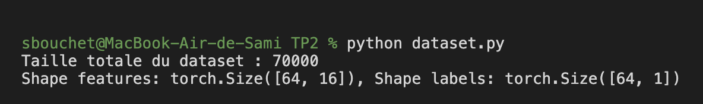
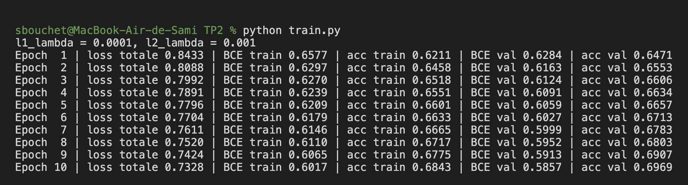
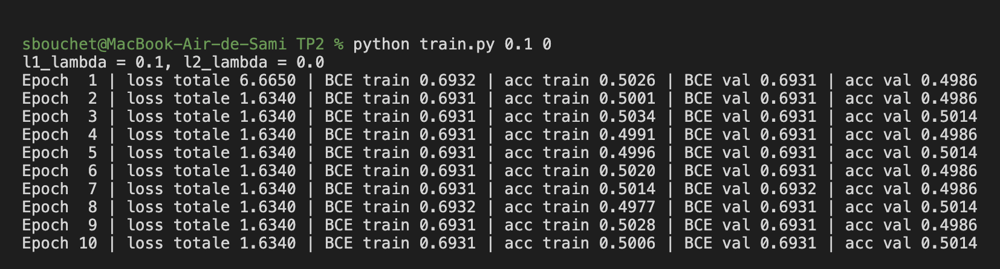
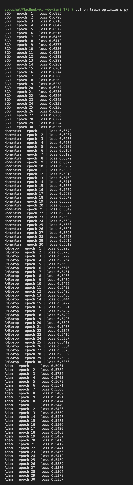
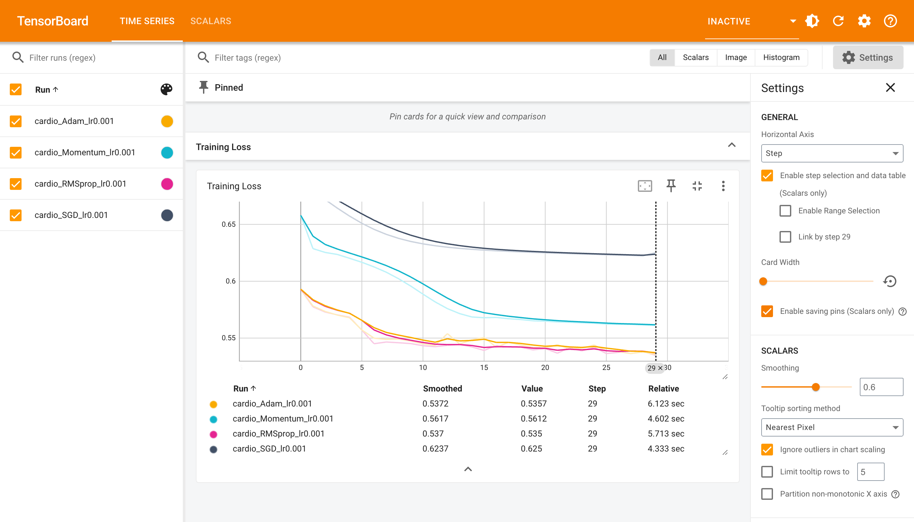
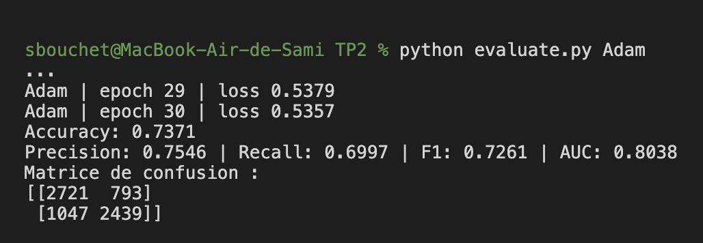

# TP2 — Régularisation, optimisation et métriques (CSC 8607 – Introduction au deep learning)

**Identifiant TSP :** sbouchet

---

## Exercice 1 — Création d'un dataset personnalisé

J'ai téléchargé `cardio_train.csv` depuis Kaggle et je l'ai mis dans `TP2/data/`. J'ai complété la classe `CardioDataset` dans `dataset.py` :

```python
def __len__(self):
    return len(self.labels)

def __getitem__(self, idx):
    if torch.is_tensor(idx):
        idx = idx.tolist()
    local_features = self.features[idx]
    local_labels = self.labels[idx]
    return {"features": local_features, "labels": local_labels}
```

Pour les DataLoaders j'ai mis `shuffle=True` pour le train (pour que les batchs changent à chaque epoch) et `shuffle=False` pour la validation.

```bash
python dataset.py
```



Le dataset fait 70 000 lignes et après le one-hot encoding on a 16 features par exemple.

**Pourquoi utiliser StandardScaler sur tout le dataset avant le split est une mauvaise pratique ?**

Le scaler calcule la moyenne et l'écart-type sur toutes les données, donc aussi sur les données de validation et de test. Du coup des informations du test "fuient" dans le prétraitement du train : c'est ce qu'on appelle le data leakage. Le modèle est évalué sur des données qui ne sont plus vraiment inconnues, donc les résultats sur le test sont un peu trop optimistes. Il faudrait faire le split d'abord, faire `fit` du scaler seulement sur le train, puis juste `transform` sur la validation et le test.

**Si le dataset faisait 500 Go, quelle classe utiliser à la place de Dataset ?**

On utiliserait `torch.utils.data.IterableDataset`. Au lieu de tout charger en RAM et d'accéder par index, il lit les données en flux (par exemple ligne par ligne ou par morceaux depuis le disque) avec `__iter__`.

---

## Exercice 2 — Régularisation L1 / L2 manuelle

J'ai créé `train.py` avec le MLP et j'ai complété la boucle :

```python
optimizer.zero_grad()
outputs = model(inputs)
base_loss = criterion(outputs, targets)
l1_penalty = sum(p.abs().sum() for p in model.parameters())
l2_penalty = sum((p ** 2).sum() for p in model.parameters())
loss = base_loss + l1_lambda * l1_penalty + l2_lambda * l2_penalty
loss.backward()
optimizer.step()
```

J'ai aussi affiché la loss, la BCE et l'accuracy sur le train et la validation à chaque epoch pour pouvoir comparer.

D'abord avec les valeurs de l'énoncé (`l1_lambda = 1e-4`, `l2_lambda = 1e-3`) :



Le modèle apprend normalement, la BCE baisse et on arrive à environ 69,7 % d'accuracy en validation après 10 epochs.

Ensuite avec `l1_lambda = 0.1` et `l2_lambda = 0` :



**Qu'observe-t-on ?**

Le modèle n'apprend plus rien. La loss totale descend de 6.67 à 1.63 dès la 2e epoch puis ne bouge plus, mais la BCE reste bloquée à 0.6931 (= ln 2) et l'accuracy reste autour de 50 %, donc le modèle répond 0.5 pour tout le monde, c'est comme du hasard.

**Pourquoi ?**

La pénalité L1 est tellement forte que l'optimiseur préfère surtout diminuer la taille des poids plutôt que de diminuer l'erreur de classification. Les poids sont poussés vers 0, le réseau devient presque constant et ne peut plus séparer les classes. C'est du **sous-apprentissage (underfitting)** : le modèle est trop contraint pour apprendre même les données d'entraînement.

**Quel argument de l'optimiseur permet d'appliquer L2 automatiquement ?**

C'est l'argument `weight_decay`, par exemple `optim.SGD(model.parameters(), lr=0.01, weight_decay=1e-3)`.

**Différence entre L1 et L2 sur les poids ?**

- L1 (somme des valeurs absolues) pousse beaucoup de poids à être exactement à 0, donc on obtient des poids parcimonieux (sparse), ça fait un peu une sélection des features.
- L2 (somme des carrés) diminue tous les poids mais sans les mettre à 0, les poids restent petits et répartis. Elle pénalise surtout les grands poids.

---

## Exercice 3 — Comparaison des optimiseurs avec TensorBoard

Dans `train_optimizers.py` j'ai mis l'entraînement dans une fonction `train_model(opt_name, learning_rate, epochs)` et j'ai complété :

```python
elif opt_name == "RMSprop":
    optimizer = optim.RMSprop(model.parameters(), lr=learning_rate)
elif opt_name == "Adam":
    optimizer = optim.Adam(model.parameters(), lr=learning_rate)
```

J'ai mis `input_size=16` car après l'encodage on a 16 features (et pas 12). J'ai aussi fixé la seed au début de chaque entraînement pour que les 4 optimiseurs partent des mêmes poids.

```bash
python train_optimizers.py
tensorboard --logdir=runs
```





| Optimiseur | Loss epoch 1 | Loss epoch 10 | Loss epoch 30 |
|---|---|---|---|
| SGD | 0.6885 | 0.6350 | 0.6250 |
| Momentum | 0.6579 | 0.5957 | 0.5612 |
| RMSprop | 0.5928 | 0.5452 | 0.5350 |
| Adam | 0.5931 | 0.5474 | 0.5357 |

**Quel optimiseur converge le plus vite au début ?**

Ce sont Adam et RMSprop, ils sont quasiment pareils : dès la première epoch ils sont à 0.593 alors que SGD est encore à 0.689. RMSprop est très légèrement devant. Les deux adaptent le learning rate pour chaque paramètre, c'est pour ça qu'ils vont plus vite.

**SGD simple vs Momentum ?**

Avec le même learning rate (0.001), SGD simple descend très lentement et finit à 0.625 après 30 epochs, alors que Momentum arrive à 0.561. Le momentum garde une partie des gradients précédents (une sorte de vitesse), donc quand les gradients vont dans la même direction les pas deviennent plus grands, et ça réduit les oscillations. La descente est plus rapide et plus régulière.

---

## Exercice 4 — Métriques de classification

J'ai complété `evaluate_model` dans `evaluate.py` :

```python
with torch.no_grad():
    ...
precision = precision_score(all_targets, all_preds_classes)
recall = recall_score(all_targets, all_preds_classes)
```

J'ai pris Adam comme meilleur modèle (avec RMSprop c'est celui qui a la loss la plus basse) et je l'ai évalué sur le test à la fin de l'entraînement. J'ai aussi affiché l'accuracy et la matrice de confusion.

```bash
python evaluate.py Adam
```



| Accuracy | Precision | Recall | F1 | AUC |
|---|---|---|---|---|
| 0.7371 | 0.7546 | 0.6997 | 0.7261 | 0.8038 |

Matrice de confusion (lignes = vraie classe, colonnes = prédiction) :

|  | prédit 0 | prédit 1 |
|---|---|---|
| **vrai 0** | 2721 (VN) | 793 (FP) |
| **vrai 1** | 1047 (FN) | 2439 (VP) |

**Définitions**

- Précision = VP / (VP + FP) : parmi les patients que le modèle prédit malades, la proportion qui sont vraiment malades.
- Rappel = VP / (VP + FN) : parmi les patients vraiment malades, la proportion que le modèle arrive à détecter.

**Plutôt forte précision ou fort rappel en médecine ?**

Je pense qu'il vaut mieux un fort rappel. Un faux négatif c'est un malade qu'on ne détecte pas et qui ne sera pas soigné, ça peut être grave. Un faux positif c'est juste une personne saine à qui on fera des examens en plus. Ici le modèle rate 1047 malades sur 3486 (rappel de 0.70), ce qui est beaucoup, on pourrait baisser le seuil en dessous de 0.5 pour augmenter le rappel (en perdant un peu de précision).

**À quoi sert l'AUC ?**

La précision, le rappel et le F1 dépendent du seuil de 0.5 qu'on a choisi. L'AUC est l'aire sous la courbe ROC, qui trace le taux de vrais positifs en fonction du taux de faux positifs pour tous les seuils possibles. Elle ne dépend donc pas du seuil et mesure si le modèle classe bien les malades au-dessus des non malades. Ici 0.80, donc dans 80 % des cas un malade pris au hasard a une probabilité plus haute qu'un non malade pris au hasard (0.5 = hasard, 1 = parfait).
